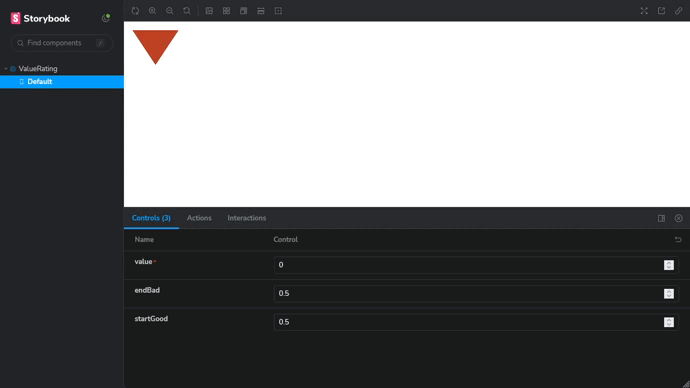

<h1 align="center">
  <⚡⚛️> Vite React Library Template
</h1>

<p align="center">
  <a href="https://github.com/TechHoruser">
    
  </a>
</p>

<p align="center">
    <a href="https://github.com/TechHoruser/typescript-react-library-template/actions/workflows/ci.yml"></a>
</p>

# ValueRating Component

The `ValueRating` component is a React component that displays a rating indicator based on a numeric value. It visually represents the value as either 'bad', 'good' or 'neutral' depending on the provided value and optional thresholds.

## Props

The component accepts the following props:

- `value` (number, required): The numeric value to be rated.
- `endBad` (number, optional, default: 0): The threshold value below which the rating is considered 'bad.'
- `startGood` (number, optional, default: 0): The threshold value above which the rating is considered 'good.'

## Usage

To use the ValueRating component, import it into your React application and include it in your JSX code. You can provide the value, endBad, and startGood props as needed to customize the rating display.

```jsx
import React from "react";
import { ValueRating } from "./ValueRating";

function App() {
  return (
    <div className="App">
      <ValueRating value={42} endBad={10} startGood={80} />
    </div>
  );
}

export default App;
```

This example will display the ValueRating component with a value of 42, where values below 10 are considered 'bad,' values above 80 are considered 'good,' and values in between are 'neutral.'

## Demo

<p align="center">
  
</p>

## Style

The `ValueRating` component allows for customization of its appearance through the use of CSS variables. You can define and override the following CSS variables to customize the visual aspects of the rating indicator:

- `--good-color` (default: #1a92b6): Defines the color for the 'good' rating status.
- `--bad-color` (default: #c04324): Defines the color for the 'bad' rating status.
- `--neutral-color` (default: #5c4f4d): Defines the color for the 'neutral' rating status.
- `--icon-height` (default: 4rem): Specifies the height of the rating icon.
- `--icon-deep` (default: 0.6rem): Determines the depth or thickness of the rating icon.
- `--icon-width` (default: calc(var(--icon-height) / 0.75)): Sets the width of the rating icon, maintaining a 3:4 aspect ratio.

You can customize these variables in your CSS stylesheet to achieve the desired look for the `ValueRating` component. For example, to change the color of the 'good' rating status to green, you can define the `--good-color` variable like this:

```css
:root {
  --good-color: #00ff00; /* Green color for 'good' rating */
}
```

Feel free to customize the component's appearance by adding CSS classes or styles as needed.

## 🔀 Related information

This application was generated using the [<⚡⚛️> TypeScript React Library Template](https://github.com/TechHoruser/typescript-react-library-template). Feel free to check it out and star the repo! 🌟😊🙌

[More Info](doc/additional-info.md)
